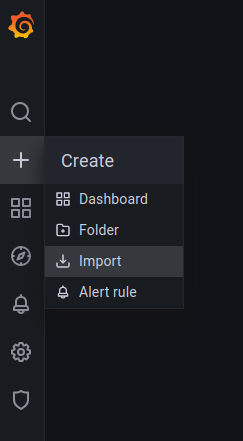
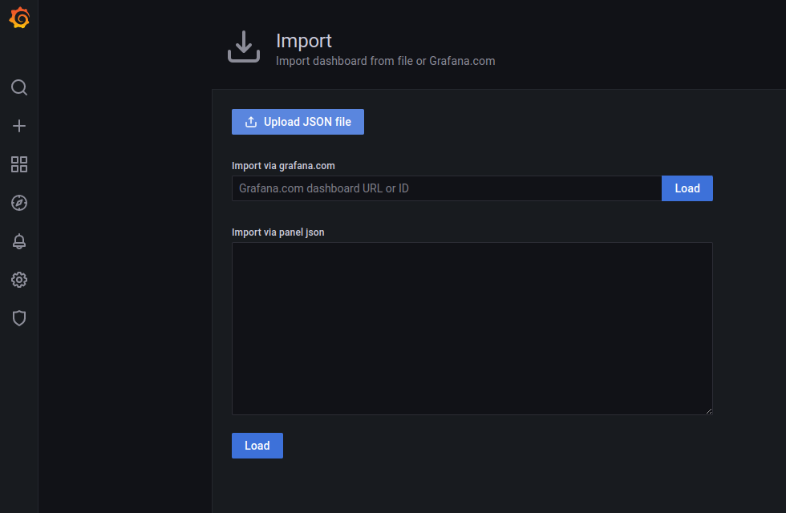
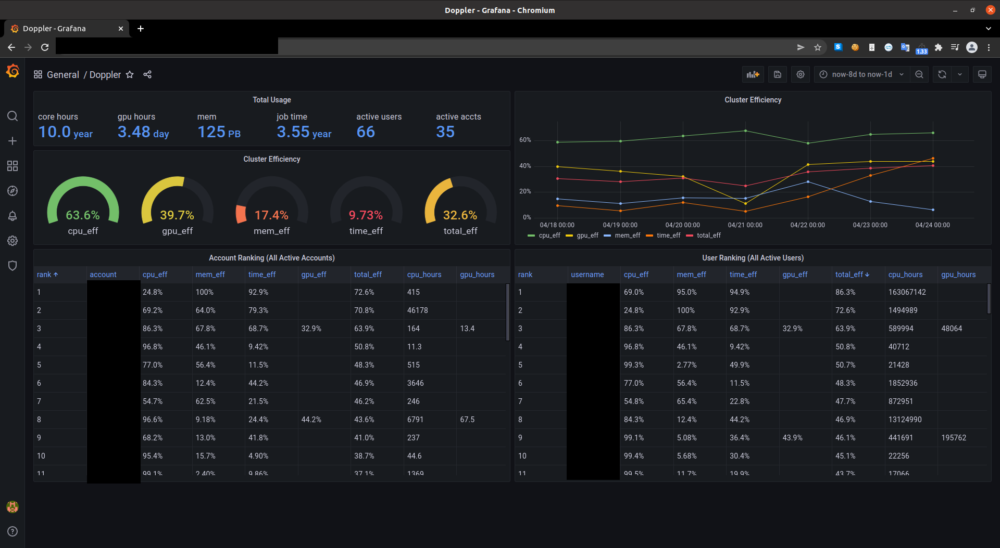
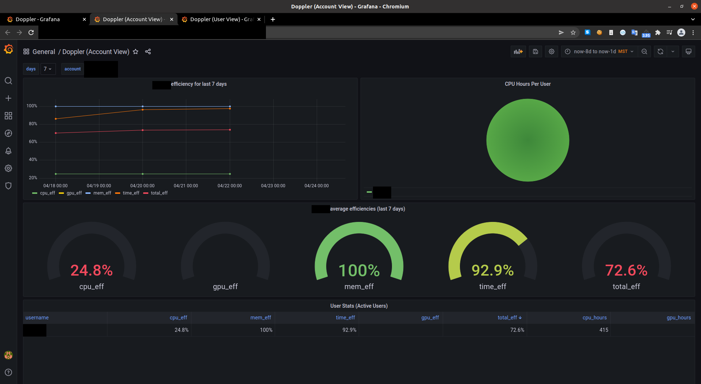
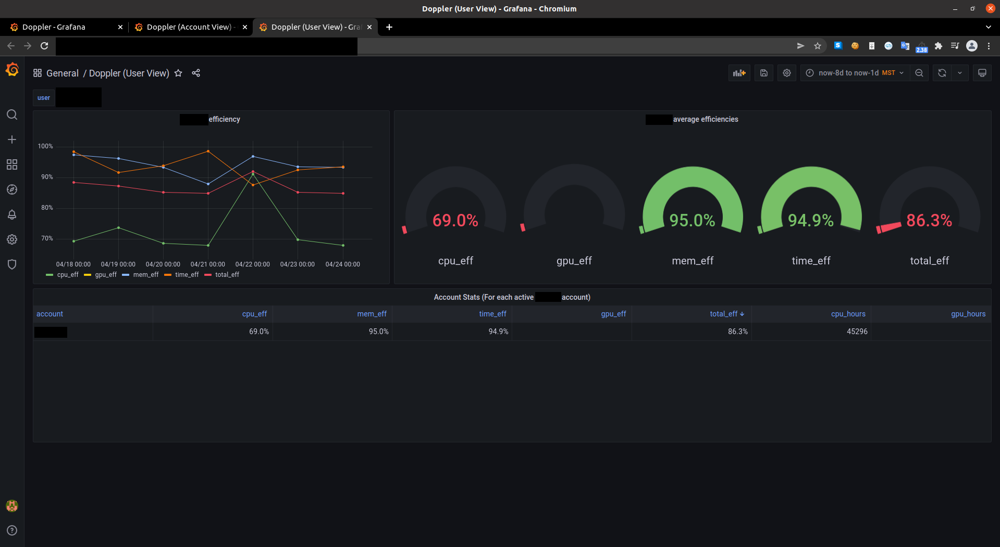

# Grafana Front-End For Jobstats Data

## Overview

This repository contains the grafana dashboards we use to display metrics from our MySQL database with grafana. These dashboards help us examine user and account efficiency for workloads researchers execute on the "Monsoon" cluster at NAU.

## Software Stack

As of this update:

1. RHEL/CENTOS
   - Our servers either run RHEL 8 or Centos Stream release 8
2. MySQL
   - rpm: mariadb-server-10.3.28-1.module+el8.3.0+10472+7adc332a.x86_64
3. Grafana
   - rpm: grafana-8.3.4-1.x86_64
4. Apache
   - rpm: httpd-2.4.37-21.module_el8.2.0+494+1df74eae.x86_64

## How do I import these dashboards into grafana?

1. Download the JSON files in this repo

2. Click the plus tab in the left hand side of the page

3. From the drop down menu, click import

   

4. Then click "Upload JSON file"

   

Or refer to the official grafana [documentation](https://grafana.com/docs/grafana/latest/dashboards/export-import/).

## What do each of the dashboards show?

- Doppler (Main)

  - Panels:

    - Total Usage - Aggregate usage among scheduled workloads for the tim period (one week by default).

    - Cluster Efficiency 1 - Aggregate job efficiency, the sum of resource usage over the total amount of resources allocated requested by the slurm scheduler.

    - Cluster Efficiency 2 - Aggregate job efficiency, the sum of resource usage over the total amount of resources allocated requested by the slurm scheduler, for each day.

    - Account Ranking - A table, showing the efficiency and usage for workloads submitted by each research group's account. Ranks are based on the total_eff column by default.

    - User Ranking - A table, showing the efficiency and usage for workloads submitted by each user. Ranks are based on the total_eff column by default.

- Doppler (Account View)

  - Panels:

    - Account Efficiency: the top left panel, is a graph showing the aggregate efficiency per day for all users that are a part of the selected account.

    - CPU Hours Per User: A pie chart, shows the breakdown of the cpu hours per user.

    - Average Efficiencies: a set of gauges that show the aggregate efficiency over the whole time period.

    - User Stats: A table, with one row for member of the account that has submitted a job within the time period (active), shows efficiency and usage metrics.

- Doppler (User View)

  - Panels:

    - Efficiency: the top left panel, is a graph showing the aggregate efficiency per day for the selected user.

    - Average Efficiencies: a set of gauges that show the aggregate efficiency over the whole time period.

    - Account Stats: Table with one entry for each account for which the user is a member and has submitted jobs under within the selected time frame. The inverse of the User Stats table from the "Doppler (Account View)" dashboard.